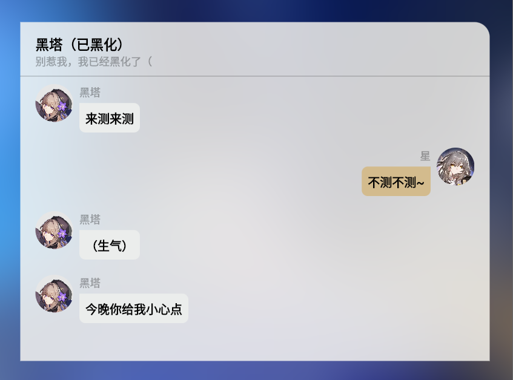

# Star Rail IM Simlulator

一个使用Flutter编写的，模拟星穹铁道聊天界面的小工具。

**目前支持的功能**

- 添加文字消息
- 选择部分角色（角色头像和名称正持续录入中）

## 使用方法

**编辑栏**

点击编辑栏“编辑对话”按钮，或点击左上角对话信息，即可编辑对话窗口信息（窗口名称，窗口备注等等）。

点击编辑栏“添加”按钮可以添加消息，点击某条消息可对消息内容进行编辑（选择角色，更改消息内容等等）。

点击编辑栏“导入/导出”按钮，即可将对话导出为JSON，或从JSON文本导入对话。

点击编辑栏“播放”按钮，可进入交互式播放模式，此模式下：

- 单击对话框，下一条消息将播放动画并显示
- 长按对话框，推出播放模式
  
  > 该模式下，无法对消息进行编辑

点击编辑栏“全屏”按钮，可控制窗口显示样式为全屏或浮动。

> Tips: 长按对话框区域，即可 显示/隐藏 对话栏

**消息编辑**

添加消息到对话框后，直接点击头像或对应的消息气泡，即可对消息进行编辑。

**消息快捷复制操作**

长按某条消息，可在其后复制一条完全相同的消息。

点击某条消息进入编辑界面，再点击“复制消息”，可在整个对话末尾复制一条完全相同的消息。

## 为本项目做出贡献

**问题反馈与建议**

如果在使用中遇到什么问题或有什么好的建议，都欢迎直接在本项目发起issue，在issue中请详细说明问题发生情况，提供问题复现方式，如果是建议，请详细描述建议内容~

**贡献属于你的一份代码**

如果各位大佬有什么好的功能和想法，且有能力对功能进行开发，非常欢迎各路大佬为本项目提供代码~

同时，如果您有意帮助本项目进行角色录入/信息录入等工作，欢迎查看相关文档进行进一步了解~

[角色头像与名称录入（文档编写中）]()

## 待办事项

| 项目                             | 状态    | 备注       |
| -------------------------------- | ------- | ---------- |
| 添加更多角色                     | ▶️进行中 | 持续录入中 |
| 添加更多类型的消息，如图片消息等 | 🕒待完成 | -          |
| 优化操作提示与UI，完善操作文档   | 🕒待完成 | -          |

## 部署地址

https://srchat.nfnf.cf

## 更新日志

[仓库更新日志](./star_rail_im_simulator/docs/Changelog.md)